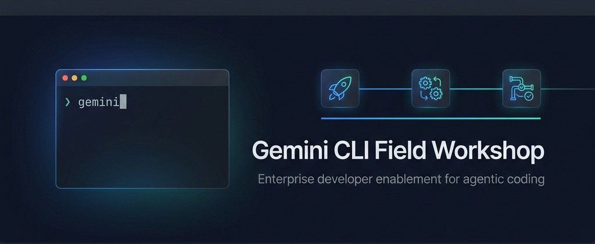

<p align="center">
  
</p>

# Gemini CLI Field Workshop

Hands-on enablement for enterprise developers — master agentic coding, legacy modernization, and DevOps automation with Gemini CLI.

## Workshop Delivery Order

| # | Use Case | Duration | Key Features |
|---|---|---|---|
| 0 | [Environment Setup](docs/setup.md) | 15 min | Install, auth, demo app |
| 1 | [SDLC Productivity Enhancement](docs/sdlc-productivity.md) | 60 min | GEMINI.md · Memory · Conductor · MCP · Extensions · Governance |
| 2 | [Legacy Code Modernization](docs/legacy-modernization.md) | 60 min | Plan Mode · Model Routing · Subagents · Skills · Checkpointing |
| 3 | [Agentic DevOps Orchestration](docs/devops-orchestration.md) | 45 min | Headless Mode · Hooks · GitHub Actions · Batch Ops |

**Why this order:** UC1 builds foundational skills (install, context engineering, governance). UC2 layers on planning and delegation. UC3 brings automation and CI/CD as the capstone.

## Quick Start

📖 **Workshop Site:** [pauldatta.github.io/gemini-cli-field-workshop](https://pauldatta.github.io/gemini-cli-field-workshop/)

```bash
git clone --recurse-submodules https://github.com/pauldatta/gemini-cli-field-workshop.git
cd gemini-cli-field-workshop
./setup.sh
cd demo-app && gemini
```

## Workshop Site

The `docs/` folder is a [Docsify](https://docsify.js.org) site. View locally:

```bash
npx -y docsify-cli serve docs/ --port 4000
```

Or deploy to GitHub Pages (Settings → Pages → Source: `/docs` on `main` branch).

## Repository Structure

```
├── docs/                        # Docsify workshop site (GitHub Pages)
│   ├── index.html               # Docsify SPA entry point
│   ├── _sidebar.md              # Navigation
│   ├── README.md                # Landing page
│   ├── setup.md                 # Environment setup guide
│   ├── sdlc-productivity.md     # Use Case 1
│   ├── legacy-modernization.md  # Use Case 2
│   ├── devops-orchestration.md  # Use Case 3
│   ├── advanced-patterns.md     # Power-user agentic patterns
│   ├── facilitator-guide.md     # Trainer delivery guide
│   ├── cheatsheet.md            # Quick reference handout
│   └── assets/                  # Diagrams and images
├── exercises/                   # Workshop exercise PRDs
├── samples/                     # Sample configurations
│   ├── config/                  # settings.json, policy.toml
│   ├── hooks/                   # Production-grade hook scripts
│   ├── agents/                  # Custom subagent definitions
│   │   ├── pr-reviewer.md       #   Code review agent (pro)
│   │   ├── doc-writer.md        #   Documentation agent (flash-lite)
│   │   ├── compliance-checker.md#   Compliance audit agent (flash-lite)
│   │   ├── release-notes-drafter.md # Release notes agent (flash-lite)
│   │   └── security-scanner.md  #   Security scanning agent (pro)
│   ├── gemini-md/               # GEMINI.md hierarchy examples
│   └── cicd/                    # GitHub Actions workflows
├── demo-app/                    # Git submodule (proshop-v2)
├── setup.sh                     # One-command environment setup
└── LICENSE                      # Apache 2.0
```

## For Trainers

See the [Facilitator Guide](docs/facilitator-guide.md) for timing options (2hr / 4hr / full day), audience-specific delivery, and live demo tips.

## License

Apache 2.0 — See [LICENSE](LICENSE).
