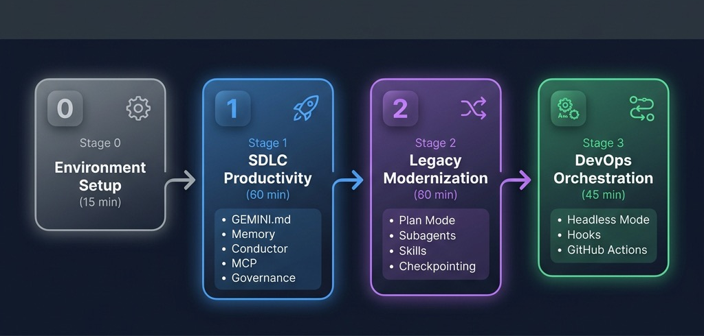

# Gemini CLI 워크숍

> **엔터프라이즈 개발자를 위한 실습형 교육** — Gemini CLI의 도구 지원 탐색, 플랜 모드, 확장 가능한 에이전트 시스템을 활용하여 에이전트 기반 코딩, 레거시 현대화 및 DevOps 자동화를 마스터하세요.
>
> *최종 업데이트: 2026-05-05 · [gemini-cli 저장소를 통해 소스 검증됨](https://github.com/google-gemini/gemini-cli)*

---
## 워크숍 흐름

이 워크숍은 **3가지 점진적인 사용 사례**로 구성되어 있습니다. 각 사용 사례는 독립적이지만 이전 단계의 스킬을 바탕으로 진행됩니다:



**이 순서로 진행하는 이유:** 사용 사례 1은 기본 스킬(설치, 컨텍스트 엔지니어링, 거버넌스)을 구축합니다. 사용 사례 2는 계획 및 위임 기능을 추가합니다. 사용 사례 3은 최종 단계로 자동화 및 CI/CD를 도입합니다. 각 단계는 이전 단계를 기반으로 합니다.

---
## 사전 요구 사항

| 요구 사항 | 세부 정보 |
|---|---|
| **Node.js** | v18 이상 ([nodejs.org](https://nodejs.org)) |
| **npm** | Node.js에 포함됨 |
| **Git** | v2.30 이상 ([git-scm.com](https://git-scm.com)) |
| **터미널** | 최신 터미널 (iTerm2, Windows Terminal, VS Code 통합 터미널) |
| **Google 계정** | 개인 Google 계정(무료 등급) 또는 Vertex AI 사용자 인증 정보(엔터프라이즈) |
| **jq** | 훅 예제용 ([jqlang.github.io/jq](https://jqlang.github.io/jq/download/)) |

---
## 빠른 시작

```bash
# Clone the workshop repo
git clone https://github.com/pauldatta/gemini-cli-field-workshop.git
cd gemini-cli-field-workshop

# Run the setup script (installs CLI, sets up demo app, copies configs)
./setup.sh

# Start the workshop
cd demo-app && gemini
```

그런 다음 워크숍 사이트를 엽니다: **[pauldatta.github.io/gemini-cli-field-workshop](https://pauldatta.github.io/gemini-cli-field-workshop/)**

---
## 사용 사례 한눈에 보기

### [1. SDLC 생산성 향상](sdlc-productivity.md)
초기 설치부터 컨텍스트 엔지니어링, Conductor를 사용한 사양 기반 개발, 거버넌스 가드레일에 이르기까지 엔터프라이즈급 개발자 워크플로우를 구축합니다. 다른 모든 것의 기반이 됩니다.

### [2. 레거시 코드 현대화](legacy-modernization.md)
플랜 모드, 사용자 지정 서브에이전트, 스킬 및 체크포인트를 사용하여 Cloud Run에서 레거시 .NET Framework 4.8 앱을 .NET 8로 마이그레이션합니다. 대규모 코드베이스를 안전하게 분해하는 방법을 알아봅니다.

### [3. 에이전트 기반 DevOps 오케스트레이션](devops-orchestration.md)
파이프라인 오류를 진단하고, 수정 사항을 생성하고, PR을 제출하고, 팀에 알리는 CI/CD 자동화를 구축합니다. 이 모든 것은 헤드리스 모드, 훅 및 GitHub Actions를 통해 이루어집니다.

---
## 데모 애플리케이션

이 워크숍에서는 풀스택 MERN 전자상거래 애플리케이션(Express.js + MongoDB + React + Redux Toolkit)인 **[ProShop v2](https://github.com/bradtraversy/proshop-v2)**를 사용합니다. 이 애플리케이션은 `demo-app/`에 git 서브모듈로 포함되어 있습니다.

---
## 보너스 도구

> **[gemini-cli-scanner](https://github.com/pauldatta/gemini-cli-scanner)** — 로컬 Gemini CLI 설치를 스캔하여 성숙도 보고서를 생성하는 TUI 도구입니다. 워크숍 이후에 실행하여 참가자의 스킬 도입, 도구 사용 패턴 및 설정 품질을 감사해 보세요. 학습 진행 상황을 시각적으로 보여주는 훌륭한 마무리 활동입니다.

---
## 리소스

| 리소스 | 링크 |
|---|---|
| Gemini CLI 문서 | [geminicli.com/docs](https://geminicli.com/docs/) |
| Gemini CLI GitHub | [google-gemini/gemini-cli](https://github.com/google-gemini/gemini-cli) |
| CLI 치트시트 | [geminicli.com/docs/cli/cli-reference](https://geminicli.com/docs/cli/cli-reference/) |
| 확장 프로그램 레지스트리 | [github.com/gemini-cli-extensions](https://github.com/gemini-cli-extensions) |
| MCP 서버 | [geminicli.com/docs/tools/mcp-server](https://geminicli.com/docs/tools/mcp-server/) |
