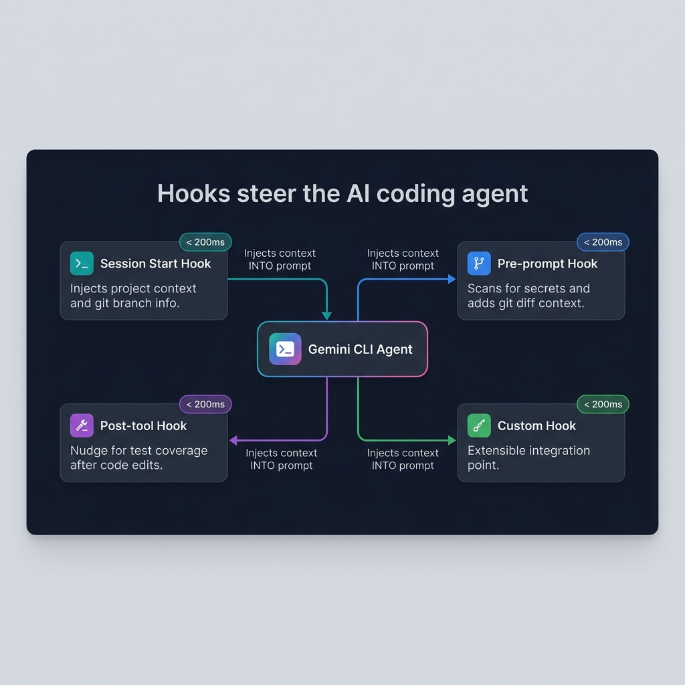

# 사용 사례 3: 에이전트 기반 DevOps 오케스트레이션

> **소요 시간:** 약 45분  
> **목표:** 파이프라인 실패를 진단하고, 수정 사항을 생성하며, PR을 제출하고, 팀에 알림을 보내는 CI/CD 자동화를 구축합니다. — 이 모든 것을 헤드리스 모드, 훅, 그리고 GitHub Actions를 통해 수행합니다.  
> **실습 PRD:** [CI/CD 파이프라인 상태 모니터](https://github.com/pauldatta/gemini-cli-field-workshop/blob/main/exercises/prd_cicd_monitor.md)
>
> *최종 업데이트: 2026-05-05 · [gemini-cli 저장소 기준 검증됨](https://github.com/google-gemini/gemini-cli)*

---
## 3.1 — 헤드리스 모드: CLI 없는 CLI (15분)

### 헤드리스 모드란 무엇인가요?

헤드리스 모드는 Gemini CLI를 비대화형으로 실행하므로 스크립트, CI/CD 파이프라인 및 자동화에 적합합니다. 사람의 개입이 필요하지 않습니다.

### 기본 헤드리스 사용법

```bash
# Pipe a prompt, get a response
gemini -p "Explain the architecture of this project in 3 sentences."

# Structured output for parsing
gemini -p "List all API endpoints in JSON format." --output-format json

# Check exit codes for automation
gemini -p "Are there any syntax errors in backend/server.js?"
echo "Exit code: $?"
# 0 = success, 1 = error, 2 = safety block
```

### Gemini를 통해 빌드 로그 전달하기

이것은 핵심 DevOps 패턴입니다. 빌드가 실패하면 진단을 위해 로그를 Gemini로 전달합니다:

```bash
# Simulate a build failure
npm test 2>&1 | gemini -p "Analyze this test output. 
Identify the failing tests, the root cause, and suggest a fix.
Classify the failure as: code_error, test_failure, flaky_test, 
infra_failure, or config_error."
```

### 자동화를 위한 구조화된 출력

```bash
gemini -p "Analyze this error log and return a JSON object with:
{
  \"failure_type\": \"code_error|test_failure|flaky_test|infra_failure|config_error\",
  \"root_cause\": \"description\",
  \"affected_files\": [\"list\"],
  \"suggested_fix\": \"description\",
  \"severity\": \"low|medium|high|critical\"
}" --output-format json < build-log.txt
```

### 스마트 커밋 스크립트

스테이징된 변경 사항에서 커밋 메시지를 생성하는 `gcommit` 별칭을 만듭니다:

```bash
# Add to ~/.bashrc or ~/.zshrc
gcommit() {
  local diff=$(git diff --cached)
  if [ -z "$diff" ]; then
    echo "No staged changes. Run 'git add' first."
    return 1
  fi
  local msg=$(echo "$diff" | gemini -p "Generate a conventional commit message 
    (type: feat|fix|refactor|docs|test|chore) for these changes. 
    Be specific about what changed. One line, max 72 characters.")
  echo "Proposed commit message:"
  echo "  $msg"
  read -p "Accept? (y/n/e for edit): " choice
  case $choice in
    y) git commit -m "$msg" ;;
    e) git commit -e -m "$msg" ;;
    *) echo "Aborted." ;;
  esac
}
```

### 일괄 처리

헤드리스 모드에서 여러 파일이나 작업을 처리합니다:

```bash
# Generate docs for every controller
for file in backend/controllers/*.js; do
  echo "📝 Generating docs for $file..."
  gemini -p "Generate JSDoc comments for every exported function 
    in this file. Include @param types, @returns, and descriptions." \
    --sandbox < "$file" > "${file%.js}.documented.js"
done
```

---
## 3.2 — DevOps를 위한 훅 (10분)

### 훅 아키텍처

훅은 특정 수명 주기 이벤트에서 에이전트 루프를 가로챕니다:



### 워크샵 훅

이 워크샵에 설정된 4개의 훅을 검토합니다:

| 훅 | 이벤트 | 목적 | 지연 시간 |
|---|---|---|---|
| `session-context.sh` | SessionStart | 브랜치 이름, 변경된 파일 수를 세션에 주입합니다. | <200ms |
| `secret-scanner.sh` | BeforeTool | 하드코딩된 자격 증명을 차단하고 환경 변수를 사용하도록 모델 스티어링을 수행합니다. | <50ms |
| `git-context-injector.sh` | BeforeTool | 대상 파일의 최근 git 기록을 주입합니다. | <100ms |
| `test-nudge.sh` | AfterTool | 소스 변경 후 에이전트가 테스트 실행을 고려하도록 상기시킵니다. | <10ms |

> **설계 원칙:** 훅은 무거운 연산이 아니라 **컨텍스트 주입기 및 모델 스티어링 도구**여야 합니다. 200ms 미만으로 유지하세요. 인지할 수 있는 지연 시간을 추가하지 않으면서 에이전트의 결정을 개선합니다.

### 나만의 훅 작성하기

JSON-over-stdin/stdout 계약:

```bash
#!/usr/bin/env bash
# 1. Read JSON input from stdin
input=$(cat)

# 2. Extract what you need with jq
tool_name=$(echo "$input" | jq -r '.tool_name')
filepath=$(echo "$input" | jq -r '.tool_input.file_path // ""')

# 3. Make a decision
# Option A: Allow (default — just return empty JSON)
echo '{}'

# Option B: Deny with reason (steers the model)
echo '{"decision":"deny","reason":"Explanation for the agent..."}'

# Option C: Inject context (systemMessage)
echo '{"systemMessage":"Additional context for the agent..."}'
```

**중요 규칙:**
- `stdout`은 **JSON 전용**입니다. 절대 디버그 텍스트를 `stdout`으로 출력하지 마세요.
- 로깅에는 `stderr`를 사용하세요: `echo "debug info" >&2`
- 단지 `{}`일지라도 항상 유효한 JSON을 반환하세요.
- 엄격한 시간 제한을 사용하세요 (최대 2~5초).
- 매처(matcher)를 사용하여 모든 도구 호출에서 실행되지 않도록 하세요.

### 알림 훅

에이전트 알림을 Slack 또는 Teams로 전달합니다:

```bash
#!/usr/bin/env bash
# Notification hook — forward to Slack
input=$(cat)
message=$(echo "$input" | jq -r '.message // ""')
title=$(echo "$input" | jq -r '.title // "Gemini CLI"')

if [ -n "$SLACK_WEBHOOK_URL" ]; then
  curl -s -X POST "$SLACK_WEBHOOK_URL" \
    -H 'Content-Type: application/json' \
    -d "{\"text\":\"*${title}*\n${message}\"}" >&2
fi
echo '{}'
```

---
## 3.3 — GitHub Actions 통합 (10분)

### 공식 GitHub Action

Google은 CI/CD에서 Gemini CLI를 실행하기 위한 퍼스트 파티 GitHub Action을 제공합니다:

```yaml
# .github/workflows/gemini-pr-review.yml
name: Gemini PR Review

on:
  pull_request:
    types: [opened, synchronize]

permissions:
  contents: read
  pull-requests: write
  id-token: write  # Required for WIF auth

jobs:
  review:
    runs-on: ubuntu-latest
    steps:
      - uses: actions/checkout@v4
        with:
          fetch-depth: 0  # Full history for better context

      - uses: google-github-actions/auth@v2
        with:
          workload_identity_provider: ${{ secrets.WIF_PROVIDER }}
          service_account: ${{ secrets.WIF_SERVICE_ACCOUNT }}

      - uses: google-github-actions/run-gemini-cli@v1
        with:
          prompt: |
            Review this PR for:
            1. Code quality and adherence to project conventions
            2. Security vulnerabilities (OWASP Top 10)
            3. Missing tests for new functionality
            4. Performance implications
            
            Post your review as a PR comment with specific 
            line references and actionable suggestions.
```

### 워크로드 아이덴티티 페더레이션 (WIF)

엔터프라이즈 배포의 경우 API 키 대신 WIF를 사용하세요:

```bash
# No secrets in your repo — GitHub authenticates via OIDC
# The WIF provider is configured once in your GCP project
gcloud iam workload-identity-pools create gemini-cli-pool \
  --location="global" \
  --display-name="Gemini CLI CI/CD"
```

> **엔터프라이즈 가치:** WIF는 저장된 자격 증명이 없음을 의미합니다. GitHub는 OIDC 토큰을 통해 GCP에 자신의 ID를 증명합니다. 교체할 API 키가 없으며, 유출될 비밀 정보도 없습니다.

### 빌드 실패 진단 파이프라인

```yaml
# .github/workflows/diagnose-failure.yml
name: Diagnose Build Failure

on:
  workflow_run:
    workflows: ["CI"]
    types: [completed]

jobs:
  diagnose:
    if: ${{ github.event.workflow_run.conclusion == 'failure' }}
    runs-on: ubuntu-latest
    steps:
      - uses: actions/checkout@v4

      - uses: google-github-actions/auth@v2
        with:
          workload_identity_provider: ${{ secrets.WIF_PROVIDER }}
          service_account: ${{ secrets.WIF_SERVICE_ACCOUNT }}

      - name: Get failed run logs
        run: |
          gh run view ${{ github.event.workflow_run.id }} --log-failed > failed-log.txt
        env:
          GH_TOKEN: ${{ secrets.GITHUB_TOKEN }}

      - uses: google-github-actions/run-gemini-cli@v1
        with:
          prompt: |
            Analyze the build failure in failed-log.txt.
            
            Classify as: code_error, test_failure, flaky_test, 
            infra_failure, or config_error.
            
            Create a GitHub issue with:
            - Root cause analysis
            - Affected files
            - Suggested fix
            - Severity rating
```

---
## 3.4 — 자동 메모리 및 일괄 작업 (10분)

### 자동 메모리 🔬

> **실험적 기능:** 자동 메모리는 현재 실험적이며, `settings.json`에서 `autoMemory: true`로 활성화해야 합니다.

여러 세션에 걸쳐 에이전트와 작업한 후, 자동 메모리는 패턴을 추출하여 스킬로 저장합니다:

```
/memory show
```

자동 학습된 메모리 예시:
- "ProShop은 모든 비동기 라우트 핸들러에 asyncHandler를 사용합니다"
- "MongoDB ObjectId는 checkObjectId 미들웨어로 검증되어야 합니다"
- "테스트 파일은 `__tests__/` 디렉토리에서 `*.test.js` 패턴을 따릅니다"

이러한 메모리는 세션 간에 유지되며 시간이 지남에 따라 에이전트의 동작을 개선합니다.

### 일괄 작업

강력한 일괄 작업을 위해 헤드리스 모드와 셸 스크립팅을 결합하세요:

```bash
# Generate API documentation for every route file
for route in backend/routes/*.js; do
  controller=$(echo "$route" | sed 's/routes/controllers/' | sed 's/Routes/Controller/')
  echo "📝 Documenting $route..."
  gemini -p "Read $route and $controller. Generate OpenAPI 3.0 
    documentation for every endpoint. Include:
    - HTTP method and path
    - Request parameters and body schema
    - Response schema with status codes
    - Authentication requirements" \
    --output-format json > "docs/api/$(basename $route .js).json"
done
```

### 연속성을 위한 세션 관리

```bash
# List recent sessions
gemini --list-sessions

# Resume a specific session by ID
gemini --resume SESSION_ID

# Continue where you left off
```

---
## 실습

**CI/CD 파이프라인 상태 모니터 PRD**를 열고 다음을 빌드하세요:

1. 진단을 위해 빌드 로그를 Gemini로 파이프하는 **헤드리스 모드** 스크립트
2. 실패 알림을 웹훅으로 전달하는 **훅**
3. PR 이벤트에서 실행되는 **GitHub Actions 워크플로우**
4. 전체 API에 대한 문서를 생성하는 **배치 스크립트**
5. 실습 중 **Auto Memory**가 캡처한 내용 검토

---
## 요약: 배운 내용

| 기능 | 설명 |
|---|---|
| **헤드리스 모드** | 스크립트 및 CI/CD에서 비대화형으로 Gemini CLI 실행 |
| **구조화된 출력** | 기계가 읽을 수 있는 응답을 위한 `--output-format json` |
| **스마트 커밋** | diff에서 conventional 커밋 메시지 생성 |
| **훅** | 수명 주기 이벤트에서의 경량 컨텍스트 주입 및 모델 스티어링 |
| **GitHub Actions** | CI/CD를 위한 퍼스트 파티 `run-gemini-cli@v1` 액션 |
| **WIF 인증** | Workload Identity Federation을 통한 무비밀(Zero-secret) 인증 |
| **자동 메모리** | 에이전트가 세션 전반에 걸쳐 패턴을 학습 |
| **일괄 처리** | 헤드리스 모드에서 파일/작업 반복 처리 |

---
## 워크숍 완료! 🎉

3가지 사용 사례를 모두 완료했습니다. 다룬 모든 내용을 빠르게 참조하려면 **[치트시트](cheatsheet.md)**를 확인하세요.

→ 더 많은 것을 원하시나요? **[고급 패턴](advanced-patterns.md)**에서는 프롬프트 작성 기술, 검증 루프, 컨텍스트 엔지니어링 및 병렬 개발을 다룹니다.

강사용: 진행 팁과 맞춤설정 옵션은 **[진행자 가이드](facilitator-guide.md)**를 참조하세요.
