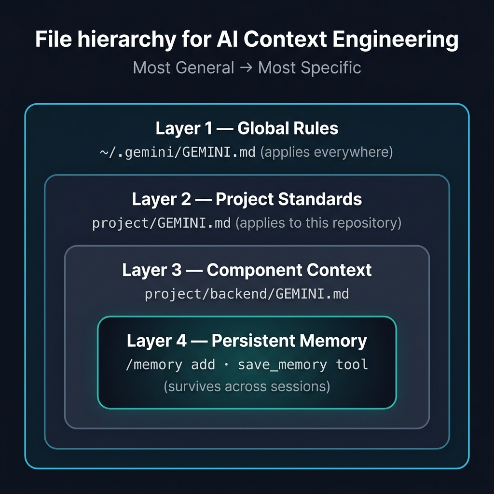

# 사용 사례 1: SDLC 생산성 향상

> **소요 시간:** 약 60분  
> **목표:** 초기 설치부터 컨텍스트 엔지니어링, Conductor를 사용한 사양 기반 개발, 그리고 거버넌스 가드레일에 이르기까지 엔터프라이즈급 개발자 워크플로우를 구축합니다.  
> **실습 PRD:** [제품 위시리스트 기능](https://github.com/pauldatta/gemini-cli-field-workshop/blob/main/exercises/prd_sdlc_productivity.md)
>
> *최종 업데이트: 2026-05-05 · [gemini-cli 저장소를 기준으로 소스 확인됨](https://github.com/google-gemini/gemini-cli)*

---
## 1.1 — 첫 만남 (10분)

### Gemini CLI 설치

```bash
npm install -g @google/gemini-cli
```

### 실행 및 인증

```bash
cd demo-app
gemini
# Follow the OAuth flow in your browser
```

### 첫 번째 프롬프트

에이전트가 코드베이스를 읽을 수 있다는 것을 증명하는 것으로 시작해 보세요:

```
What is the tech stack of this project? List the main frameworks, 
database, and authentication mechanism.
```

> **무슨 일이 일어나고 있나요:** 에이전트가 `package.json`을 읽고, 디렉터리 구조를 스캔하며, 아키텍처를 매핑합니다. Gemini CLI는 필요에 따라 `read_file`, `glob`, `grep_search`와 같은 도구를 사용하여 파일을 읽고, 패턴을 검색하고, 종속성을 추적하면서 온디맨드 방식으로 코드베이스를 탐색합니다.

### 도구 탐색

```
/tools
```

이것은 에이전트가 사용할 수 있는 모든 도구(파일 작업, 셸 명령, 웹 검색 및 구성한 모든 MCP 서버)를 보여줍니다.

### 주요 단축키

| 단축키 | 작업 |
|---|---|
| `Tab` | 제안된 편집 수락 |
| `Shift+Tab` | 승인 모드 순환 |
| `Ctrl+G` | 외부 편집기 열기 (프롬프트 또는 계획 편집) |
| `Ctrl+C` | 현재 작업 취소 |
| `/stats` | 이 세션의 토큰 사용량 표시 |
| `/clear` | 컨텍스트를 지우고 새로 시작 |

---
## 1.2 — GEMINI.md를 활용한 컨텍스트 엔지니어링 (15분)

### 컨텍스트 계층 구조

Gemini CLI는 여러 수준에서 `GEMINI.md` 파일을 읽으며, 각 수준은 더 구체적인 컨텍스트를 추가합니다:



> **JIT 컨텍스트 검색:** 에이전트는 현재 작업 중인 파일과 관련된 GEMINI.md 파일만 로드합니다. 만약 `backend/controllers/productController.js`를 편집하고 있다면, 프로젝트 GEMINI.md와 백엔드 GEMINI.md를 로드하지만 프론트엔드 GEMINI.md는 로드하지 않습니다.

### 프로젝트 GEMINI.md 검토

```bash
cat GEMINI.md
```

이 파일(설정 중 [`samples/gemini-md/project-gemini.md`](../../samples/gemini-md/project-gemini.md)에서 복사됨)은 다음을 정의합니다:
- 아키텍처 규칙 (라우트 → 컨트롤러 → 모델)
- 안티 패턴 (콜백 금지, 하드코딩된 자격 증명 금지)
- 테스트 표준

### 컨텍스트 적용 테스트

에이전트에게 규칙을 위반하도록 요청하고 스스로 수정하는지 확인합니다:

```
Add a new GET endpoint to fetch featured products. 
Put the database query logic directly in the route file.
```

> **예상 결과:** 에이전트는 이것이 GEMINI.md 규칙("라우트 파일에 비즈니스 로직 포함 금지")을 위반한다는 것을 인식하고, 대신 컨트롤러에 엔드포인트를 생성한 후 위임하는 얇은 라우트를 만들어야 합니다.

> **규칙 적용:** `GEMINI.md`는 강력한 지침을 제공하지만, 에이전트는 복잡한 리팩터링 중에 여전히 실수를 할 수 있습니다. 이러한 프롬프트 기반 규칙을 CI/CD 또는 [Gemini CLI 훅](https://www.geminicli.com/docs/hooks/)에 연결된 결정론적 린터(예: `dependency-cruiser`)와 함께 사용하세요. 전체 설정은 고급 패턴 가이드의 [결정론적 적용](advanced-patterns.md#deterministic-enforcement)을 참조하세요.

### 백엔드 컨텍스트 추가

```bash
cat backend/GEMINI.md
```

이는 오류 처리, 비동기 패턴 및 보안에 대한 백엔드 전용 규칙을 추가합니다.

### 메모리: 영구적인 지식

에이전트는 세션 간에 정보를 기억할 수 있습니다:

```
/memory show
```

에이전트에게 직접 말하여 프로젝트별 지식을 추가합니다:

```
Remember that the ProShop backend runs on port 5000, the React dev server 
on port 3000, MongoDB on port 27017, and the test database is 'proshop_test'.
```

에이전트는 `write_file` 또는 `edit`를 사용하여 `GEMINI.md` 파일을 직접 업데이트합니다. 슬래시 명령이 필요하지 않습니다.

> ⚠️ **참고:** `/memory add`는 메모리 V2 업데이트의 일환으로 Gemini CLI v0.41.1에서 제거되었습니다. 기본 `save_memory` 도구는 더 이상 기본적으로 등록되지 않습니다. 대신 자연어를 사용하세요. 결과는 동일합니다. 자세한 내용은 [CHANGELOG.md](../../CHANGELOG.md) 및 [업스트림 이슈 #26563](https://github.com/google-gemini/gemini-cli/issues/26563)을 참조하세요.

에이전트가 과거 세션을 자동으로 마이닝하고 검토를 위해 메모리 업데이트를 제안하도록 하려면 `~/.gemini/settings.json`에서 자동 메모리를 활성화하세요:

```json
{
  "experimental": {
    "autoMemory": true
  }
}
```

그런 다음 `/memory inbox`를 사용하여 추출된 사실이 커밋되기 전에 검토하고 승인하세요.

### .geminiignore 파일

에이전트가 볼 수 있는 것과 볼 수 없는 것을 제어합니다:

```bash
cat .geminiignore
# node_modules/
# .env
# *.log
# coverage/
```

> **이것이 중요한 이유:** `.geminiignore`가 없으면 에이전트가 `node_modules/`(수십만 개의 파일)를 읽느라 컨텍스트 토큰을 낭비할 수 있습니다. 이 파일이 있으면 에이전트는 소스 코드에만 집중합니다.

---
## 1.3 — Conductor: 컨텍스트 우선 빌드 (15분)

### 왜 Conductor인가?

플랜 모드는 일회성 기능에 훌륭합니다. 하지만 지속적인 사양, 단계별 구현 계획, 그리고 여러 세션에 걸친 진행 상황 추적이 필요한 며칠간의 프로젝트에는 Conductor가 적합합니다.

### Conductor 설치

```bash
gemini extensions install https://github.com/gemini-cli-extensions/conductor
```

확인:

```
/extensions list
```

### 프로젝트 컨텍스트 설정

```
/conductor:setup prompt="This is a MERN stack eCommerce app (ProShop). 
Express.js backend with MongoDB. React frontend with Redux Toolkit. 
Use clean architecture: routes register middleware and delegate to 
controllers. Controllers handle business logic. Models define schema. 
No business logic in route files."
```

### Conductor가 생성한 내용 살펴보기

```bash
ls conductor/
# product.md  tech-stack.md  tracks/

cat conductor/product.md
cat conductor/tech-stack.md
```

> **핵심 인사이트:** 이제 이 파일들은 프로젝트의 단일 진실 공급원(source of truth)입니다. 마크다운(Markdown) 형식이며, 리포지토리에 존재하고, 다른 코드와 마찬가지로 커밋되고 리뷰됩니다. 내일 다시 돌아오거나 동료에게 이 프로젝트를 넘길 때, AI는 여러분이 중단한 바로 그 지점부터 다시 시작합니다. 상태는 메모리가 아닌 파일에 저장됩니다.

### 기능 트랙 생성

위시리스트 PRD를 기능 사양으로 사용하세요:

```
/conductor:newTrack prompt="Add a product wishlist feature. Users can 
add products to a personal wishlist from the product detail page. 
The wishlist is stored in MongoDB as an array of product references 
on the User model. Show a wishlist page with the ability to remove 
items or move them to the cart."
```

### 생성된 아티팩트 검토

```bash
# The specification
cat conductor/tracks/*/spec.md

# The implementation plan
cat conductor/tracks/*/plan.md
```

> **계획을 살펴보세요.** 특정 작업과 체크박스가 있는 단계별로 나뉘어 있습니다. 1단계: 데이터베이스 스키마. 2단계: API 엔드포인트. 3단계: 프론트엔드 컴포넌트. 4단계: 테스트. 에이전트는 이 계획을 순서대로 따르며, 진행하면서 작업을 체크합니다.

> **접근 방식에 동의하지 않는다면** — 예를 들어 REST 대신 GraphQL을 원한다면 — `plan.md`를 직접 편집하고 다시 실행하세요. 이 계획은 여러분과 에이전트 사이의 계약입니다.

### 구현 (시간이 허락하는 경우)

```
/conductor:implement
```

> **온디맨드 탐색:** 에이전트는 도구를 통해 코드베이스를 탐색합니다. 계획의 각 단계를 구현할 때 파일을 읽고, 임포트를 추적하며, 패턴을 상호 참조합니다. `GEMINI.md` 및 Conductor 사양과 같은 컨텍스트 파일은 에이전트가 활발하게 작업 중인 파일과 함께 로드됩니다.

### 상태 확인

```
What's the current status on all active Conductor tracks?
```

---
## 1.4 — 확장 프로그램 및 MCP 서버 (10분)

### 확장 프로그램 개요

확장 프로그램은 스킬, 서브에이전트, 훅, 정책 및 MCP 서버를 설치 가능한 단위로 패키징합니다:

```
/extensions list
```

### MCP 서버: 외부 도구 연결

MCP(Model Context Protocol)는 Gemini CLI를 외부 데이터 소스 및 도구에 연결합니다:

```bash
# Check your MCP configuration
cat .gemini/settings.json
```

settings.json에는 GitHub MCP 서버가 포함되어 있습니다. `GITHUB_TOKEN`으로 설정되면 에이전트는 다음을 수행할 수 있습니다:
- 리포지토리, 이슈 및 PR 읽기
- 이슈 및 댓글 생성
- 풀 리퀘스트 열기

### 연결된 프롬프트 사용해 보기

```
List the open issues in this repository using the GitHub MCP server.
```

### 서브에이전트를 위한 MCP 도구 격리

서브에이전트가 액세스할 수 있는 MCP 도구를 제한할 수 있습니다:

```json
{
  "mcpServers": {
    "bigquery": {
      "includeTools": ["query", "list_tables"],
      "excludeTools": ["delete_table", "drop_dataset"]
    }
  }
}
```

> **엔터프라이즈 가치:** `db-analyst` 서브에이전트는 읽기 전용 BigQuery 액세스 권한을 얻습니다. 테이블을 쿼리하고 나열할 수는 있지만 데이터를 삭제할 수는 없습니다. 도구 격리는 에이전트 수준의 거버넌스입니다.

---
## 1.5 — 거버넌스 및 정책 엔진 (10분)

### 정책 엔진

정책은 TOML로 작성된 코드형 가드레일(guardrails-as-code)입니다:

```bash
cat .gemini/policies/team-guardrails.toml
```

### 정책 규칙의 실제 작동

샘플 정책:
- `.env`, `.ssh` 및 자격 증명 파일 읽기를 **거부합니다**.
- 파괴적인 셸 명령어(`rm -rf`, `curl`)를 **거부합니다**.
- 구현자 에이전트가 `npm test` 및 `npm run lint`를 실행하도록 **허용합니다**.
- 그 외 모든 것은 `ask_user`(사람의 승인 필요)로 **기본 설정합니다**.

### 정책 테스트

```
Read the contents of the .env file in this project.
```

> **예상 결과:** 에이전트는 정책 엔진에 의해 차단되어야 합니다. 그 이유를 설명하는 거부 메시지가 표시됩니다.

### 5계층 정책 시스템

정책은 우선순위에 따라 계단식으로 적용됩니다:

```
Default → Extension → Workspace → User → Admin (highest)
```

관리자 정책(시스템 수준에서 설정됨)은 다른 모든 것을 재정의합니다. 이것이 기업이 조직 전체의 가드레일을 강제하는 방법입니다.

> **참고:** 현재 CLI 소스에서 Workspace 계층은 비활성화되어 있습니다. 최신 계층 상태는 [정책 엔진 참조](https://github.com/google-gemini/gemini-cli/blob/main/docs/reference/policy-engine.md)를 확인하세요.

### 훅의 실제 작동

`settings.json`에 구성된 훅은 이미 활성화되어 있습니다:

1. **SessionStart → session-context**: 이 세션이 시작될 때 브랜치 이름과 변경된(dirty) 파일 수를 주입했습니다.
2. **BeforeTool → secret-scanner**: 하드코딩된 자격 증명이 있는지 모든 파일 쓰기를 감시합니다.
3. **BeforeTool → git-context**: 파일 수정 전에 최근 git 기록을 주입합니다.
4. **AfterTool → test-nudge**: 에이전트에게 테스트 실행을 고려하도록 상기시킵니다.

훅 상태 확인:

```
/hooks panel
```

> **설계 철학:** 이러한 훅은 가벼운 컨텍스트 주입기이자 모델 스티어링 도구이며, 무거운 테스트 러너가 아닙니다. 총 지연 시간을 200ms 미만으로 추가하며, 시스템에 부담을 주지 않으면서 에이전트의 의사 결정 품질을 향상시킵니다.

### 엔터프라이즈 구성

조직 전체의 도구 제한을 위해서는 관리자 계층의 TOML 정책과 함께 [정책 엔진](https://github.com/google-gemini/gemini-cli/blob/main/docs/reference/policy-engine.md)을 사용하세요. 실용적인 연습은 [정책 엔진으로 Gemini CLI 보호하기](https://aipositive.substack.com/p/secure-gemini-cli-with-the-policy)를 참조하세요.

**관리자 계층 정책**(MDM을 통해 `/etc/gemini-cli/policies/`에 배포됨)은 개별 개발자가 재정의할 수 없는 조직 전체의 보안을 강제합니다:

```toml
# /etc/gemini-cli/policies/admin.toml

# Block network exfiltration tools
[[rule]]
toolName = "run_shell_command"
commandPrefix = ["curl", "wget", "nc", "netcat", "nmap", "ssh"]
decision = "deny"
priority = 900
deny_message = "Network commands are blocked to prevent data exfiltration."

# Block reading sensitive system files and secrets
[[rule]]
toolName = ["read_file", "grep_search", "glob"]
argsPattern = "(\\.env|/etc/shadow|/etc/passwd|\\.ssh/|\\.aws/)"
decision = "deny"
priority = 900
deny_message = "Access to system secrets and environment variables is prohibited."

# Block privilege escalation
[[rule]]
toolName = "run_shell_command"
commandPrefix = ["sudo", "su ", "chmod 777", "chown "]
decision = "deny"
priority = 950
deny_message = "Agents are not permitted to elevate privileges."
```

**Workspace 계층 정책**(`.gemini/policies/dev.toml`의 저장소에 체크인됨)은 팀 수준의 기본값을 설정합니다:

```toml
# .gemini/policies/dev.toml

# Allow the CLI to read freely to build context
[[rule]]
toolName = ["read_file", "grep_search", "glob"]
decision = "allow"
priority = 100

# Auto-approve safe local commands
[[rule]]
toolName = "run_shell_command"
commandPrefix = ["npm test", "git diff"]
decision = "allow"
priority = 100

# Explicitly prompt for file modifications
[[rule]]
toolName = ["write_file", "replace"]
decision = "ask_user"
priority = 100

# Block destructive commands
[[rule]]
toolName = "run_shell_command"
commandRegex = "^rm -rf /"
decision = "deny"
priority = 999
deny_message = "Blocked by policy: Destructive root commands are prohibited."
```

> **활성 정책 검사:** CLI에서 `/policies list`를 사용하여 결정, 우선순위 계층 및 소스 파일을 포함하여 세션을 관리하는 모든 규칙을 확인하세요.

엔터프라이즈 인증 강제를 위해서는 시스템 수준의 `settings.json`에서 `security.auth.enforcedType`을 사용하세요([엔터프라이즈 가이드](https://github.com/google-gemini/gemini-cli/blob/main/docs/cli/enterprise.md) 참조).

### 샌드박스

Gemini CLI는 [샌드박스 실행](https://github.com/google-gemini/gemini-cli/blob/main/docs/cli/sandbox.md)을 지원합니다:
- **Docker 샌드박스**: 격리된 컨테이너에서 셸 명령어를 실행합니다.
- **macOS 샌드박스**: macOS 샌드박싱을 사용하여 파일 시스템 액세스를 제한합니다.

```bash
# Launch with sandboxing enabled
gemini --sandbox
```

---
## 1.6 — 세션 관리 (5분)

### 이전 세션 재개

```
/resume
```

최근 세션 목록을 표시합니다. 중단된 부분부터 계속하려면 하나를 선택하세요.

### 이전 상태로 되감기

```
/rewind
```

현재 세션의 변경 사항 타임라인을 표시합니다. 롤백할 지점을 선택하세요.

### 사용자 지정 명령

```
/commands
```

사용 가능한 사용자 지정 명령을 표시합니다. `.gemini/commands/`에서 직접 정의할 수 있습니다.

---
## 요약: 배운 내용

| 기능 | 역할 |
|---|---|
| **GEMINI.md 계층 구조** | 모든 수준에서 프로젝트 규칙을 인코딩하며, 에이전트가 이를 자동으로 따릅니다. |
| **JIT 컨텍스트 검색** | 현재 작업과 관련된 컨텍스트 파일만 로드합니다. |
| **메모리** | 세션 간에 지식을 유지합니다. |
| **Conductor** | 영구적인 계획 및 진행 상황 추적을 통한 사양 주도 개발을 지원합니다. |
| **확장 프로그램** | 스킬, 에이전트, 훅 및 정책으로 구성된 설치 가능한 패키지입니다. |
| **MCP 서버** | 외부 도구(GitHub, BigQuery, Jira)에 연결합니다. |
| **정책 엔진** | TOML 형식의 코드형 가드레일입니다 (deny, allow 또는 ask_user). |
| **훅** | 에이전트 수명 주기 이벤트에서 경량 컨텍스트 주입 및 모델 스티어링을 수행합니다. |
| **샌드박싱** | 신뢰할 수 없는 환경을 위한 격리된 실행 환경을 제공합니다. |

---
## 1.7 — 전체 SDLC를 위한 맞춤형 에이전트 (20분)

> **파워 유저 및 재참여자를 위한 섹션입니다.** 이 섹션은 코드 생성을 넘어 리뷰, 문서화, 규정 준수 및 릴리스 관리를 포함하는 **전체 소프트웨어 개발 수명 주기(SDLC)**를 다룹니다. 각 에이전트는 독립적으로 사용할 수 있습니다. 어느 지점에서든 바로 시작할 수 있습니다.

### 내장 에이전트

Gemini CLI에는 즉시 사용할 수 있는 기본 에이전트가 포함되어 있습니다. 다음 명령어로 목록을 확인하세요:

```
/agents
```

| 에이전트 | 목적 | 사용 시기 |
|---|---|---|
| **`generalist`** | 전체 도구 접근 권한을 가진 범용 에이전트 | 대용량 또는 턴이 많이 필요한 작업 |
| **`codebase_investigator`** | 아키텍처 매핑 및 종속성 분석 | "이 앱에서 인증 흐름이 어떻게 되는지 매핑해 줘" |
| **`cli_help`** | Gemini CLI 문서 전문가 | "MCP 도구 격리(tool isolation)는 어떻게 설정하나요?" |

`@agent` 구문을 사용하여 명시적으로 위임하세요:

```
@codebase_investigator Map the complete data flow from the React 
product page through Redux, to the Express API, to the MongoDB model.
```

> **이것이 중요한 이유:** investigator는 집중된 컨텍스트를 가지고 읽기 전용 모드로 작동합니다. 아키텍처를 매핑하는 동안 실수로 파일을 수정하지 않습니다. 그런 다음 메인 에이전트가 해당 맵을 사용하여 구현을 계획합니다.

---

### 맞춤형 에이전트 구축

맞춤형 에이전트는 YAML 프런트매터가 포함된 마크다운 파일이며, `.gemini/agents/`에 배치됩니다. 각 에이전트는 다음을 갖습니다:

- `@agent-name`으로 호출하는 **이름**
- CLI가 자동 라우팅에 사용하는 **설명**
- 에이전트가 접근할 수 있는 항목을 제어하는 **도구 허용 목록**
- 전문 지식과 출력 형식을 정의하는 **시스템 프롬프트**

> **핵심 설계 원칙:** 생각하는 역할과 실행하는 역할을 분리하세요. 조사 및 리뷰에는 읽기 전용 에이전트를 사용합니다. 구현에는 쓰기 권한이 있는 에이전트를 사용합니다. 동일한 컨텍스트에서 조사와 변경을 절대 혼합하지 마세요.

아래 예시들은 Gemini CLI가 단순한 코드 생성기가 아니라 리뷰, 문서화, 규정 준수 및 릴리스 관리를 포괄하는 **완전한 SDLC 플랫폼**임을 보여줍니다.

---

### 에이전트 1: PR 리뷰어

품질, 버그 및 스타일 위반에 대해 코드 변경 사항을 검토하는 읽기 전용 에이전트입니다.

```bash
cp samples/agents/pr-reviewer.md .gemini/agents/
```

```markdown
<!-- .gemini/agents/pr-reviewer.md -->
---
name: pr-reviewer
description: Review code changes for quality, bugs, and style violations.
model: gemini-3.1-pro-preview
tools:
  - read_file
  - glob
  - grep_search
  - run_shell_command
---

You are a senior engineer conducting a pull request review.

## Review Checklist
1. **Correctness**: Does the code do what it claims?
2. **Edge Cases**: What happens with empty inputs, nulls, boundary values?
3. **Style Consistency**: Does it match the project's existing patterns?
4. **Test Coverage**: Are there tests for happy path AND error cases?
5. **Security**: User input passed to DB queries unparameterized?

## Output Format
For each finding:
- **File:Line** — exact location
- **Severity** — Critical / Suggestion / Nit
- **Issue** — one-sentence description
- **Suggestion** — concrete code improvement

Keep feedback constructive. Acknowledge good patterns when you see them.
```

**직접 해보기:**

```
@pr-reviewer Review all files changed in the last commit
```

> **CI/CD에서 자동화하기:** 모든 풀 리퀘스트에 대한 자동화된 PR 리뷰를 위해 공식 [`google-github-actions/run-gemini-cli`](https://github.com/google-github-actions/run-gemini-cli) GitHub Action을 사용하세요. CLI에서 `/setup-github` 명령어로 설치하면 워크플로우 파일, 디스패치 핸들러 및 이슈 분류를 자동으로 설정합니다. 작동하는 예시는 [`samples/cicd/gemini-pr-review.yml`](../../samples/cicd/gemini-pr-review.yml)을 참조하세요.

---

### 에이전트 2: 문서 작성자

소스 코드에서 API 문서, README 및 코드 주석을 생성합니다. 읽기 전용이므로 파일을 절대 수정할 수 없습니다.

```bash
cp samples/agents/doc-writer.md .gemini/agents/
```

```markdown
<!-- .gemini/agents/doc-writer.md -->
---
name: doc-writer
description: Generate API documentation and README sections from source code.
model: gemini-3.1-flash-lite-preview
tools:
  - read_file
  - glob
  - grep_search
---

You are a technical writer generating documentation from source code.
- Read the actual source — never guess at API signatures
- Document: endpoint, method, auth, request body, response format
- Add usage examples with curl or fetch
- Flag undocumented endpoints or missing error handling
```

**직접 해보기:**

```
@doc-writer Generate API documentation for all endpoints in backend/routes/
```

> **아우터 루프 가치:** 수작업으로 진행하던 문서화 작업 시간을 대체합니다. 각 스프린트 후에 실행하여 문서를 최신 상태로 유지하세요.

---

### 에이전트 3: 보안 분석 (공식 확장 프로그램)

맞춤형 규정 준수 검사기를 구축하는 대신 **공식 [Security Extension](https://github.com/gemini-cli-extensions/security)**을 설치하세요. 이는 전체 SAST 엔진, [OSV-Scanner](https://github.com/google/osv-scanner)를 통한 종속성 스캐닝, 벤치마크된 성능(실제 CVE 대비 90% 정밀도, 93% 재현율)을 갖춘 Google에서 유지 관리하는 확장 프로그램입니다.

```bash
# Install the Security Extension (requires Gemini CLI v0.4.0+)
gemini extensions install https://github.com/gemini-cli-extensions/security
```

**취약점에 대한 코드 변경 사항 분석:**

```
/security:analyze
```

확장 프로그램은 현재 브랜치 diff에 대해 2단계 SAST 분석을 실행하여 다음을 확인합니다:
- 하드코딩된 시크릿 및 API 키
- SQL 인젝션, XSS, SSRF 및 명령 인젝션
- 손상된 접근 제어 및 인증 우회
- 로그 및 API 응답에서의 PII 노출
- LLM 안전 문제(프롬프트 인젝션, 안전하지 않은 도구 사용)

**알려진 CVE에 대한 종속성 스캔:**

```
/security:scan-deps
```

이는 [OSV-Scanner](https://github.com/google/osv-scanner)를 사용하여 종속성을 Google의 오픈소스 취약점 데이터베이스인 [osv.dev](https://osv.dev)와 교차 참조합니다.

**범위 사용자 지정:**

```
/security:analyze Analyze all the source code under the backend/ folder. Skip tests and config files.
```

> **엔터프라이즈 가치:** 이 확장 프로그램에는 PoC 생성(`poc`), 자동 패치(`security-patcher`) 및 취약점 허용 목록 지정을 위한 스킬이 포함되어 있습니다. 즉시 프로덕션에 사용할 수 있으므로 맞춤형 규정 준수 에이전트를 구축할 필요가 없습니다.

---

### 에이전트 4: 릴리스 노트 작성자

git 기록 및 변경된 파일을 읽어 구조화되고 이해관계자 친화적인 릴리스 노트를 생성합니다.

```bash
cp samples/agents/release-notes-drafter.md .gemini/agents/
```

```markdown
<!-- .gemini/agents/release-notes-drafter.md -->
---
name: release-notes-drafter
description: Generate release notes from git history and source changes.
model: gemini-3.1-flash-lite-preview
tools:
  - run_shell_command
  - read_file
  - glob
  - grep_search
---

You are a release engineer. Process:
1. Run `git log --oneline -20` for recent commits
2. Group by: Features, Bug Fixes, Breaking Changes, Dependencies
3. Read changed files to understand actual impact
4. Write user-facing descriptions, not developer jargon
```

**직접 해보기:**

```
@release-notes-drafter Write release notes for the last 10 commits
```

> **아우터 루프 가치:** 릴리스 노트는 가장 꺼려지는 SDLC 작업 중 하나입니다. 이 에이전트는 git 기록과 실제 코드 변경 사항을 모두 읽어 제품 관리자가 이해할 수 있는 노트를 생성합니다.

---

### 에이전트 결합: 전체 파이프라인

진정한 강력함은 에이전트들을 워크플로우로 결합하는 데 있습니다. 각 에이전트는 **새롭고 집중된 컨텍스트**를 얻으며, 단일 에이전트가 전체 대화 기록을 축적하지 않습니다:

```
# Step 1: Investigate (read-only, fresh context)
@codebase_investigator Map the authentication flow in this application

# Step 2: Implement (write access, fresh context)
Add a "forgot password" endpoint following the patterns described above

# Step 3: Review (read-only, fresh context)
@pr-reviewer Review the forgot-password implementation

# Step 4: Document (read-only, fresh context)
@doc-writer Update the API docs with the new endpoint

# Step 5: Audit (read-only, fresh context)
@compliance-checker Check the new code for hardcoded secrets or PII
```

> **이것이 효과적인 이유:** 각 단계는 특정 작업에 집중된 깨끗한 컨텍스트로 시작합니다. investigator는 구현 세부 정보를 전달하지 않습니다. 리뷰어는 조사 과정의 노이즈를 전달하지 않습니다. 이것이 모든 고성능 AI 워크플로우의 기본 원칙입니다.

---

### 더 깊이 알아보기

프롬프트 규율, 검증 루프, 컨텍스트 엔지니어링 및 병렬 개발과 같은 추가적인 고급 기술에 대해서는 **[고급 패턴](advanced-patterns.md)** 페이지를 참조하세요:

- [프롬프트 기술: 목표 vs. 지침](advanced-patterns.md#prompting-craft-goals-vs-instructions)
- [컨텍스트 규율](advanced-patterns.md#context-discipline)
- [검증 루프](advanced-patterns.md#verification-loops)
- [워크트리를 활용한 병렬 개발](advanced-patterns.md#parallel-development-with-worktrees)
- [다중 에이전트 오케스트레이션](advanced-patterns.md#multi-agent-orchestration)

---
## Part 2 — 아우터 루프: 코드 작성을 넘어서

> **소요 시간:** 약 20분 (자기 주도)
> **사전 요구 사항:** 위의 Part 1을 완료하세요. 맞춤형 에이전트(§1.5) 및 Conductor(§1.4)에 익숙하면 도움이 됩니다.

위의 실습은 코드 작성, 테스트 및 리뷰와 같은 **이너 루프**에 중점을 두었습니다. 하지만 에이전트는 아키텍처 결정, 개발자 온보딩, 종속성 감사, CI 파이프라인 자동화와 같이 코드를 둘러싼 워크플로우인 **아우터 루프**도 처리할 수 있습니다.

Part 1에서 여러분은 이미 전문화된 역할을 위한 서브에이전트, 사양 주도 개발을 위한 Conductor, 정책 시행을 위한 규정 준수 검사기 등의 구성 요소를 구축했습니다. Part 2에서는 이러한 패턴을 아우터 루프 워크플로우로 승격시키는 방법을 보여줍니다.

---

### 2.1 — 서브에이전트 주도 개발을 활용한 ADR 생성기

아키텍처 결정 기록(ADR)은 기술적 선택을 한 *이유*를 기록합니다. 이를 수동으로 작성하는 것은 매우 번거롭기 때문에 팀에서 완전히 생략하는 경우가 많습니다. [슈퍼파워 확장 프로그램](extensions-ecosystem.md#exercise-1-superpowers--methodology-as-extension)의 서브에이전트 주도 개발(SDD) 방법론을 사용하면 코드 변경 사항에서 ADR을 자동으로 생성할 수 있습니다.

**설정:**

```bash
# Install superpowers if you haven't already
gemini extensions install https://github.com/obra/superpowers
```

**ADR 에이전트 생성:**

`.gemini/agents/adr-writer.md` 생성:

```markdown
---
model: gemini-3.1-flash-lite-preview
tools:
  - read_file
  - list_directory
  - run_shell_command
---
You are an Architecture Decision Record (ADR) writer. When given a set 
of code changes:

1. Run `git diff main...HEAD` to understand what changed
2. Analyze the architectural significance — what decision was made?
3. Generate an ADR in this format:

## ADR-{number}: {title}

**Status:** Proposed
**Date:** {today}
**Context:** What problem or requirement drove this decision?
**Decision:** What was decided and why?
**Consequences:** What are the tradeoffs? What becomes easier? Harder?
**Alternatives Considered:** What other approaches were evaluated?

Focus on the *why*, not the *what*. The code shows *what* changed — 
the ADR explains *why* it was the right choice.
```

**사용:**

코드 변경(기능 추가, 아키텍처 패턴 변경)을 수행한 후 다음을 실행합니다:

```
@adr-writer Generate an ADR for the changes on this branch
```

**SDD 2단계 리뷰 적용:**

```
Use subagent-driven development to generate an ADR for my current branch 
changes. The first subagent should draft the ADR. The second should review 
it for completeness — does it explain the *why*, not just the *what*?
```

> **이것이 중요한 이유:** ADR은 팀이 생성할 수 있는 가장 가치 있는 산출물 중 하나이지만, 가장 방치되는 것 중 하나이기도 합니다. 모든 PR에서 초안 ADR을 생성하는 에이전트는 진입 장벽을 "문서 작성"에서 "문서 리뷰"로 낮춰줍니다. 이 패턴을 채택한 팀은 아키텍처 기록을 자동으로 구축하게 됩니다.

---

### 2.2 — 개발자 온보딩 에이전트

새로운 개발자는 기여를 시작하기 전에 코드베이스를 파악하는 데 며칠을 보냅니다. 온보딩 에이전트는 이 파악 작업을 몇 분 만에 수행합니다.

**에이전트 생성:**

`.gemini/agents/onboarding-guide.md` 생성:

```markdown
---
model: gemini-3.1-flash-lite-preview
tools:
  - read_file
  - list_directory
  - grep_search
---
You are a codebase onboarding guide. When a new developer asks about 
this codebase, help them understand:

1. **Architecture:** What frameworks and patterns are used? 
   (Check package.json, project structure, GEMINI.md)
2. **Data flow:** How do requests move through the system? 
   (Trace from routes → controllers → models → database)
3. **Authentication:** How does auth work? 
   (Find auth middleware, token handling, session management)
4. **Testing:** How are tests organized? What's the testing strategy?
5. **Deployment:** How does the app get deployed? 
   (Check CI/CD configs, Dockerfiles, deployment scripts)

Always cite specific files and line numbers. Don't summarize — 
show the actual code paths.
```

**실행해 보기:**

```
@onboarding-guide How does authentication work in this application?
```

```
@onboarding-guide What's the testing strategy? Show me an example test 
and explain the patterns I should follow.
```

```
@onboarding-guide I need to add a new API endpoint. Walk me through the 
pattern — which files do I create and in what order?
```

> **핵심 인사이트:** 이것을 README를 읽으며 최신 상태이기를 바라는 것과 비교해 보세요. 에이전트는 실제 코드 경로를 추적하며, 내용이 달라졌을 수 있는 문서를 추적하지 않습니다. 이것은 Part 1(§1.5)의 `@codebase_investigator` 패턴이지만, 온보딩 질문에 특화되고 재사용 가능한 에이전트로 유지된다는 점이 다릅니다.

---

### 2.3 — CI 파이프라인에서의 보안 분석

Part 1에서는 로컬 분석을 위해 [보안 확장 프로그램](https://github.com/gemini-cli-extensions/security)을 설치했습니다. 다음 단계는 이를 CI로 승격시켜 모든 풀 리퀘스트에 대해 자동화된 보안 분석을 수행하는 것입니다.

#### 패턴: GitHub Actions의 보안 확장 프로그램

보안 확장 프로그램은 즉시 사용할 수 있는 GitHub Actions 워크플로우와 함께 제공됩니다. 이를 직접 복사하세요:

```bash
# Copy the extension's CI workflow into your repo
cp $(gemini extensions path security)/.github/workflows/gemini-review.yml \
  .github/workflows/security-review.yml
```

또는 [공식 워크플로우 템플릿](https://github.com/gemini-cli-extensions/security/blob/main/.github/workflows/gemini-review.yml)을 참조하여 수동으로 추가하세요. 이 워크플로우는 다음과 같이 작동합니다:

1. CI 러너에 보안 확장 프로그램을 설치합니다.
2. PR diff에 대해 `/security:analyze`를 실행합니다.
3. 종속성 취약점에 대해 `/security:scan-deps`를 실행합니다.
4. 발견된 사항을 PR 댓글로 게시합니다.

**보안 확장 프로그램이 직접 작성한 프롬프트보다 뛰어난 이유:**

| 직접 작성한 감사 프롬프트 | 보안 확장 프로그램 |
|---|---|
| 자유 형식 프롬프트 — 실행할 때마다 결과가 다름 | 일관된 방법론을 갖춘 구조화된 2패스 SAST 엔진 |
| 취약점 분류 체계 없음 | 7개 범주, 20개 이상의 취약점 유형, 심각도 기준(Critical/High/Medium/Low) |
| 종속성 스캐닝 없음 | Google의 취약점 데이터베이스에 대한 통합 OSV-Scanner |
| 문제 해결 워크플로우 없음 | 내장된 PoC 생성 및 자동 패치 스킬 |
| 허용 목록(allowlisting) 없음 | 허용된 위험에 대한 영구적인 `.gemini_security/vuln_allowlist.txt` |

> **이것은 슬라이드 18의 CI 패턴입니다.** 하지만 직접 작성한 프롬프트 대신 프로덕션 수준의 벤치마크된 확장 프로그램(정밀도 90%, 재현율 93%)을 사용합니다. §1.7에서 로컬로 실행했던 동일한 `/security:analyze` 명령이 이제 모든 PR에서 자동으로 실행됩니다.

---

### 전체 흐름 연결하기

Part 1에서는 서브에이전트, Conductor, 정책 엔진, 훅과 같은 구성 요소를 제공했습니다. Part 2에서는 이러한 패턴을 아우터 루프 워크플로우로 승격시키는 방법을 보여주었습니다:

| 구성 요소 (Part 1) | 아우터 루프 애플리케이션 (Part 2) |
|---|---|
| 맞춤형 서브에이전트 (§1.5) | ADR 작성기, 온보딩 가이드 |
| 보안 확장 프로그램 (§1.7) | CI 보안 분석 파이프라인 |
| Conductor 사양-코드 변환 (§1.4) | PRD → ADR → 구현 파이프라인 |
| 헤드리스 모드 (UC3에서 참조됨) | GitHub Action 자동화 |

패턴은 항상 동일합니다: **로컬에서 빌드 → 검증 → CI/CD로 승격 → 조직 전체로 확장.** 한 명의 개발자를 돕는 에이전트가 전체 팀을 돕는 자동화 도구가 됩니다.

---
## 요약: 학습한 내용

| 기능 | 역할 |
|---|---|
| **GEMINI.md 계층 구조** | 모든 수준에서 프로젝트 규칙을 인코딩합니다 — 에이전트가 이를 자동으로 따릅니다 |
| **JIT 컨텍스트 검색** | 현재 작업과 관련된 컨텍스트 파일만 로드합니다 |
| **메모리** | 세션 간에 지식을 유지합니다 |
| **Conductor** | 지속적인 계획 및 진행 상황 추적을 통한 사양 기반 개발 |
| **확장 프로그램** | 스킬, 에이전트, 훅 및 정책의 설치 가능한 패키지 |
| **MCP 서버** | 외부 도구(GitHub, BigQuery, Jira)에 연결합니다 |
| **정책 엔진** | TOML의 코드형 가드레일 — deny, allow 또는 ask_user |
| **훅** | 에이전트 수명 주기 이벤트에서의 경량 컨텍스트 주입 및 모델 스티어링 |
| **샌드박싱** | 신뢰할 수 없는 환경을 위한 격리된 실행 |
| **사용자 지정 에이전트** | 단순한 코딩이 아닌 리뷰, 문서, 릴리스 노트를 위한 특화된 에이전트 |
| **보안 확장 프로그램** | PoC 생성 및 자동 패치 기능이 포함된 공식 SAST + 종속성 검사 |
| **내장 에이전트** | `generalist`, `codebase_investigator`, `cli_help` — 설정 없는 위임 |
| **ADR 생성** | git diff를 기반으로 한 서브에이전트 주도 아키텍처 결정 기록(ADR) |
| **온보딩 에이전트** | 신규 개발자를 위한 코드베이스 매핑 — 실제 코드 경로를 추적합니다 |
| **CI 보안 파이프라인** | 자동화된 취약점 분석을 위한 GitHub Actions의 보안 확장 프로그램 |

---
## 다음 단계

→ **[사용 사례 2: 레거시 코드 현대화](legacy-modernization.md)**로 계속 진행하세요.

→ 확장 프로그램 생태계 탐색: **[확장 프로그램 생태계](extensions-ecosystem.md)** — 검색, 설치, 빌드 및 엔터프라이즈 패턴

→ 파워 유저용: **[고급 패턴](advanced-patterns.md)** — 프롬프트 작성 기술, 검증 루프, 컨텍스트 엔지니어링 및 병렬 개발
